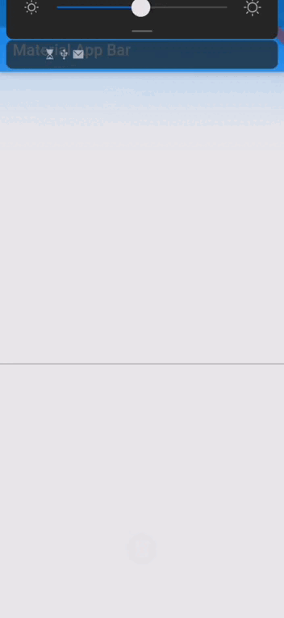

# tdtxle_inputs_flutter

**tdtxle_inputs_flutter** es un paquete de widgets personalizados de imputs



Implementacion con la  **branch**:
```yaml
dependencies:
  flutter:
    sdk: flutter

 tdtxle_inputs_flutter:
    git:
      url: https://github.com/LuisDeLaValie/tdtxle_inputs_flutter.git
      ref: master # branch name

```

Implementacion con el **commit**:
```yaml
dependencies:
  flutter:
    sdk: flutter

  tdtxle_inputs_flutter:
    git:
      url: https://github.com/LuisDeLaValie/tdtxle_inputs_flutter.git
      ref: 392fe22 # commit hash
```


## Uso
---


<details>
  <summary>Input IMG</summary>

  ### *ImagenPerfil*
  Este Widgets mustra solo una imagen, puede recibir tanto un archivo de imagen como una url. 

  ```dart
    ImagenPerfil(
      required imgPath: String,
      elevation: double?,
      borderRadius = BorderRadius.zero,
      color: Color?,
      child: Widget?,
      height: double?,
      width: double?,
    )
  ```

    ### *SubuirFotos*
  La clase *SubuirFotos* que te permite elegir un archivo de imagen del dispositivo. 

  - `getImageLibrary`:
    Abre directamente la galería para poder elegir una imagen.
  - `cameraImage`:
    Abra directamente la cámara para tomar la foto.
  - `selectCamera`:
    Abre un modal para que el usuario puede elegir entre abrir la galeria o la camara.
    
  ### *ImageFormField*
   El Widget *ImageFormField* es un FormField que te permite seleccionar un archivo de imagen del telefono para poder mostrar.
  ```dart
    ImageFormField(
      initialValue: String,
      onSaved: void Function(String? newValue),
      validator: String? Function(String? value),
      onChanged: Function(String? value),
      child: Widget,
      width: double,
      height: double,
      typePicker: TypePicker,
      elevation: double,
      borderRadius: BorderRadius,
    )
  ```
  

</details>
<details>
  <summary>Input Chip</summary>
  

  ### *ChipField* / *ChipFormField*
  *ChipField* / *ChipFormField* es un campo de texto que te permite separar palabras mediante chips.


```dart
ChipField(
    decoration: InputDecoration?,
    initValue: List<ChipItem<T>?>?,
    onChanged: Function(List<ChipItem<T>?>)?,
    onSubmitted: Function(List<ChipItem<T>?>)?,
    chipLabelStyle: TextStyle?,
    chipBackgroundColor: Color?,
    chipDeleteIconColor: Color?,
  )
```

```dart
ChipFormField(
    decoration:InputDecoration?,
    onChanged:List<ChipItem<T>>?,
    onSubmitted:Function(List<ChipItem<T>?>)?,
    chipLabelStyle:Function(List<ChipItem<T>?>)?,
    chipBackgroundColor:TextStyle?,
    chipDeleteIconColor:Color?,
    onSaved:Color?,
    validator:void Function(List<ChipItem<T>?>?)?,
    initialValue:String? Function(List<ChipItem<T>?>?)?,
  )
```


### *ChipDialog*
*ChipDialog* muestra un Diálogo para poder elegir entre opciones ya establecidas.

```dart
 ChipDialog(
    decoration: InputDecoration?,
    required data: List<ChipItem>,
    required chipBuilder: Chip Function(ChipItem<T>?),
    selectChipBuilder: Chip Function(ChipItem<T>?)?,
    required onChanged: void Function(List<T>),
  )
```
  

  
</details>

<details>
  <summary>Imput Select</summary>

  ### *SelectField*
  El widget ***SelectField*** / ***SelectFieldFuture*** es lo mismo que un TextField con la adición de una lista emergente que se actualizará a medida que se escriba en el TextField.

  ### *SelectField*
  ```dart
    SelectField(
      required values: List<SelectItem<String>>,
      settingsTextField: SelectFieldSettings?,
      settingsList: SelectListSettings?,
      onSelected: void Function(String)?,
      debounce: int, // default 500 
      showCloseButton: bool?,
      onCloseButton: void Function()?,
      iconCloseButton: Widget?,    
    )
  ```
  ### *SelectFieldFuture*
  ***SelectFieldFuture*** es igual que ***SelectField*** solo que en ves de recibir una lista de *SelectItem* recibe una funcion que retorna una lista de *SelectItem*.
  ```dart
    SelectFieldFuture(
      required values: Future<List<SelectItem<Object?>>> Function(String),
      settingsTextField: SelectFieldSettings?,
      settingsList: SelectListSettings?,
      onSelected: void Function(Object?)?,
      debounce: int, // default 500 
      showCloseButton: bool?,
      onCloseButton: void Function()?,
      iconCloseButton: Widget?,
    )
  ```
  

  ### *SelectItem*
  ```dart
    SelectItem(
      required value: String,
      required search: String,
      required title: Widget,
      subtitle: Widget?,
      trailing: Widget?,
      leading: Widget?,
    )
  ```

</details>
